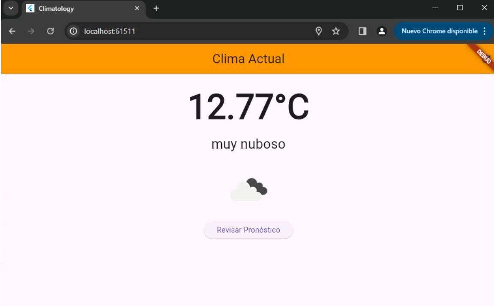
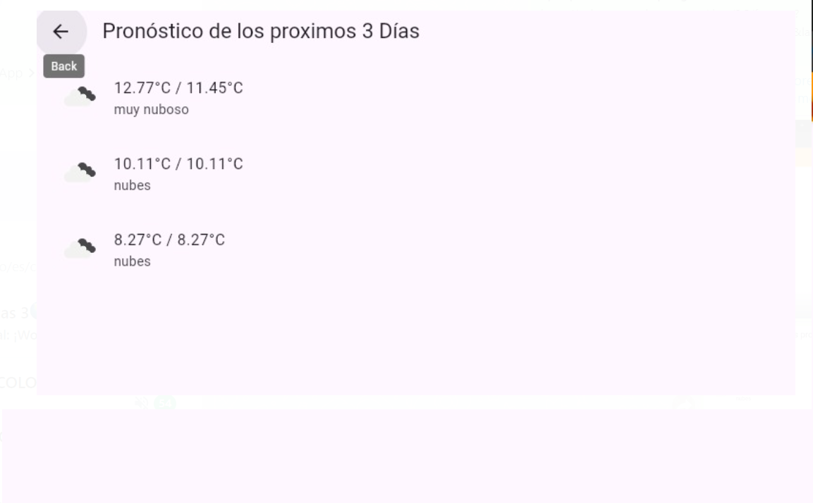

# flutter_application_1

A new Flutter project.

## Getting Started

This project is a starting point for a Flutter application.

1. Descripción del Proyecto
Segun lo solicitado, se realizo una aplicacion sencilla que muestar el clima en tiempo real segun la ubicacion del usuario, solo necesita permisos de localizacion y con esto mostrara el clima actual con una pequeña imagen de referencia, tambien se puede revisar el pronostico de los proximos 3 dias con un boton que se incluyo.

2. Instrucciones para Instalar y Ejecutar la Aplicación
Para ejecutar la aplicacion en un equipo necesitamos tener instalado un visor de codigo en este caso, yo use visual studio code, una vez tengamos esto debemos instalar flutter y dart en el visor de codigo para que podamos ejecutar el programa, posteriormente debemos ejecutar el comando "flutter pub get" para descargar todos los paquetes necesarios para la ejecucion , por ultimo simplemente debemos ejecutar el programa con el emulador de preferencia, por ultimo damos los permisos a la app para acceder a la ubicacion y con esto ya podriamos ver  la aplicacion en funcionamiento

3. API Key
Se proporciona un api key en el archivo servicioclima.dart en donde se ve como se hace el llamado a la api y se usa una clave api que se incluye en el codigo.

Capturas de pantalla de la app

